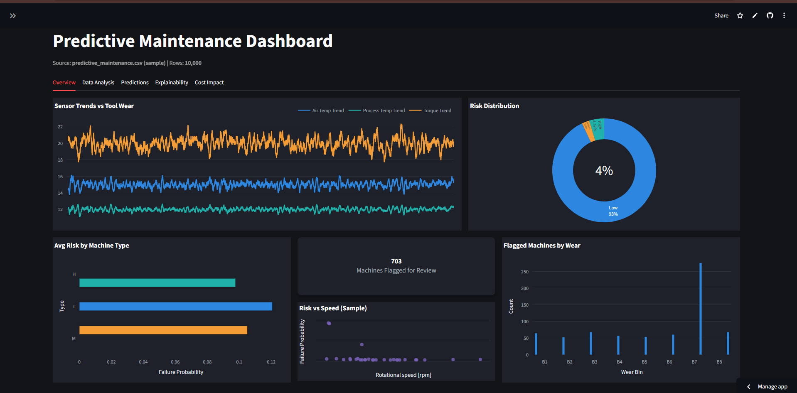
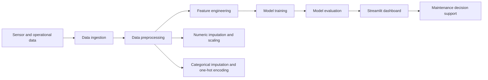
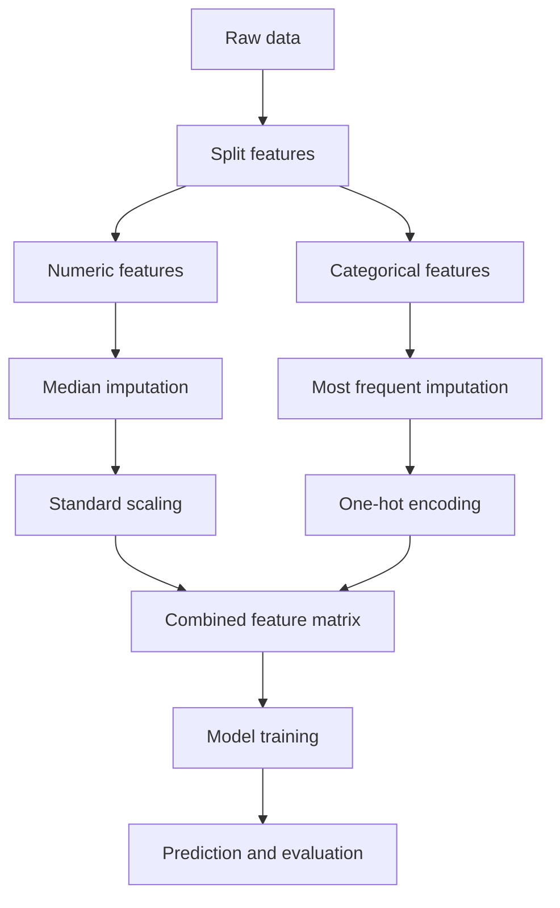

# Predictive Maintenance for Manufacturing Machines

[](https://share.google/Bc6eyqEl7dDNDKxcY)

A production-ready machine learning project for predicting manufacturing equipment failures from sensor data, helping reduce downtime, improve maintenance planning, and lower operational costs.

---


## Project Overview

This project builds both **binary classification** and **multi-class classification** solutions for predictive maintenance. The binary task predicts whether a machine will fail in the near future, while the multi-class task identifies the likely failure type. The solution is designed around key operational signals such as temperature, torque, rotational speed, and tool wear.

## Problem Statement

Manufacturing environments need early warnings before equipment breaks down. This project addresses that need by:

- Predicting whether a failure will occur soon.
- Identifying the likely failure category when a failure happens.
- Highlighting the most important sensor and operational features for decision-making.

## Live Demo

Explore the deployed Streamlit dashboard here:

[Open the Live Demo](https://share.google/Bc6eyqEl7dDNDKxcY)

---

## System Architecture



## Data Description

| Item | Details |
|---|---|
| Dataset size | 10,000 rows |
| Feature count | 14 features |
| Target type | Binary target: 0 = Normal, 1 = Failure |
| Product types | L, M, H |
| Core sensor features | Air temperature, Process temperature, Rotational speed, Torque, Tool wear |
| Failure types | Heat Dissipation, Power, Overstrain |

## Key Exploratory Insights

The dataset is highly imbalanced, with failures making up about 3.4% of all observations. Heat Dissipation and Power Failure are the most frequent failure modes, which makes class imbalance a central modeling challenge. Tool wear is the strongest predictor of failure, and rotational speed shows a negative correlation with torque.

Failures also cluster in two operational regions: low speed with high torque, and high speed with low torque. Product type L shows the highest failure rate, making it an important segment for maintenance prioritization.

---

## Data Preprocessing & Modeling Pipeline



## Preprocessing Pipeline

| Feature group | Processing |
|---|---|
| Numeric features | Median imputation + standard scaling |
| Categorical features | Most frequent imputation + one-hot encoding |
| Target variable | Binary classification target |
| Evaluation focus | Robustness under class imbalance |

## Features Used

| Feature | Type | Role |
|---|---|---|
| Air temperature [K] | Numeric | Operating condition |
| Process temperature [K] | Numeric | Operating condition |
| Rotational speed [rpm] | Numeric | Machine behavior |
| Torque [Nm] | Numeric | Load indicator |
| Tool wear [min] | Numeric | Wear and degradation signal |
| Product type | Categorical | Operational context |
| Additional recorded variables | Mixed | Supporting predictive signal |

## Models Tested

| Model | Purpose |
|---|---|
| Logistic Regression | Linear baseline |
| Random Forest | Bagged tree benchmark |
| ExtraTrees | Highly randomized tree ensemble |
| GradientBoosting | Boosted tree baseline |
| AdaBoost | Adaptive boosting baseline |
| XGBoost | Gradient boosting ensemble |
| LightGBM | Efficient gradient boosting ensemble |
| CatBoost | Categorical-aware boosting ensemble |

## Model Performance

| Model | AUC | F1 Macro | Recall Macro | Precision Macro |
|---|---:|---:|---:|---:|
| XGBoost | 0.978 | 0.872 | 0.882 | 0.862 |
| LightGBM | 0.978 | 0.841 | — | — |
| GradientBoosting | 0.977 | — | — | — |
| CatBoost | 0.977 | — | — | — |

XGBoost is the best overall model based on the reported metrics. It delivers the strongest balance of ranking quality and class-level performance, which is especially valuable in an imbalanced maintenance setting.

## Insights and Recommendations

The analysis shows that tool wear is the strongest predictor, so it should receive the highest monitoring priority. Product type L has the highest failure rate, which suggests it may require stricter inspection schedules or tailored operating limits. The most practical interventions are predictive maintenance scheduling, maintenance prioritization, and operational guideline updates to avoid high-strain zones.

## How to Run

```bash
git clone https://github.com/ahmedhamdy-DS/manufacturing-predictive-maintenance.git
cd manufacturing-predictive-maintenance
pip install -r requirements.txt
streamlit run app.py
```

## Repository Structure

A typical project structure for this solution includes the application entry point, dependencies, and model workflow assets used to support the Streamlit dashboard. The repository is organized to make local setup straightforward and to keep the deployment-ready dashboard reproducible.

---

## Author

Ahmed Hamdy Abdelaziz

## Contact

- GitHub: [@ahmedhamdy-DS](https://github.com/ahmedhamdy-DS)
- Portfolio: [my-web-3ciq.vercel.app](https://my-web-3ciq.vercel.app)
- LinkedIn: [linkedin.com/in/My-profile](https://www.linkedin.com/in/ahmed-hamdy-4569a8360/)
