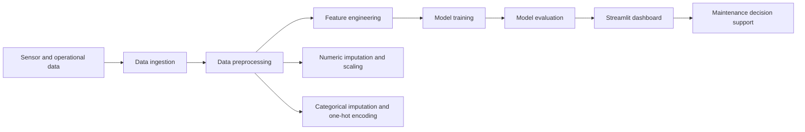
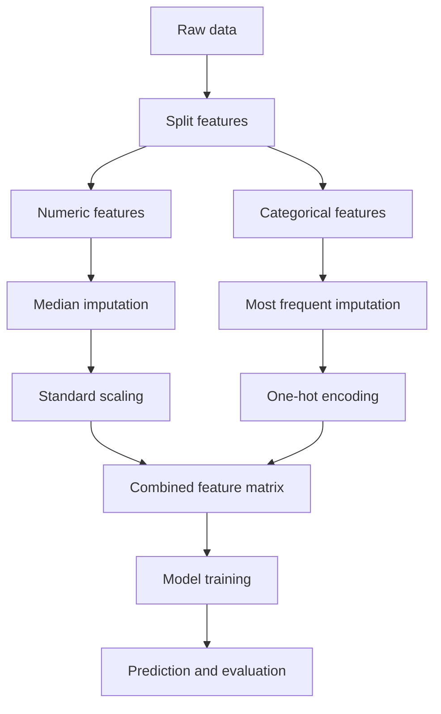

# Predictive Maintenance for Manufacturing Machines

[](https://share.google/Bc6eyqEl7dDNDKxcY)
[](https://www.python.org/)
[](https://xgboost.readthedocs.io/)

A production-ready machine learning project for predicting manufacturing equipment failures from sensor data — helping reduce downtime, improve maintenance planning, and lower operational costs.


---

## Table of Contents
- [Project Overview](#project-overview)
- [Problem Statement](#problem-statement)
- [System Architecture](#system-architecture)
- [Data Description](#data-description)
- [Key Exploratory Insights](#key-exploratory-insights)
- [Modeling Pipeline](#data-preprocessing--modeling-pipeline)
- [Models Tested](#models-tested)
- [Model Performance](#model-performance)
- [Business Impact](#business-impact)
- [Model Explainability (SHAP)](#model-explainability-shap)
- [Insights and Recommendations](#insights-and-recommendations)
- [How to Run](#how-to-run)
- [Author](#author)

---


## Project Overview

This project builds a **binary classification** solution for predictive maintenance, predicting whether a machine will fail in the near future based on key operational signals such as temperature, torque, rotational speed, and tool wear.

## Problem Statement

Manufacturing environments need early warnings before equipment breaks down. This project addresses that need by:

- Predicting whether a failure will occur soon.
- Identifying the likely failure category when a failure happens.
- Highlighting the most important sensor and operational features for decision-making.


---

## System Architecture



## Data Description

| Item | Details |
|---|---|
| Dataset size | 10,000 rows |
| Feature count | 14 features |
| Target type | Binary target: 0 = Normal, 1 = Failure |
| Product types | L, M, H |
| Core sensor features | Air temperature, Process temperature, Rotational speed, Torque, Tool wear |
| Failure modes observed | Heat Dissipation, Power, Overstrain |

## Key Exploratory Insights

The dataset is highly imbalanced, with failures making up about **3.4%** of all observations. Heat Dissipation and Power Failure are the most frequent failure modes, making class imbalance a central modeling challenge. Tool wear is the strongest predictor of failure, and rotational speed shows a negative correlation with torque.

Failures also cluster in two operational regions: low speed with high torque, and high speed with low torque. Product type **L** shows the highest failure rate, making it an important segment for maintenance prioritization.

---

## Data Preprocessing & Modeling Pipeline



| Feature group | Processing |
|---|---|
| Numeric features | Median imputation + standard scaling |
| Categorical features | Most frequent imputation + one-hot encoding |
| Target variable | Binary classification target |
| Evaluation focus | Robustness under class imbalance |

## Features Used

| Feature | Type | Role |
|---|---|---|
| Air temperature [K] | Numeric | Operating condition |
| Process temperature [K] | Numeric | Operating condition |
| Rotational speed [rpm] | Numeric | Machine behavior |
| Torque [Nm] | Numeric | Load indicator |
| Tool wear [min] | Numeric | Wear and degradation signal |
| Product type | Categorical | Operational context |

## Models Tested

| Model | Purpose |
|---|---|
| Logistic Regression | Linear baseline |
| Random Forest | Bagged tree benchmark |
| ExtraTrees | Highly randomized tree ensemble |
| GradientBoosting | Boosted tree baseline |
| AdaBoost | Adaptive boosting baseline |
| XGBoost | Gradient boosting ensemble |
| LightGBM | Efficient gradient boosting ensemble |
| CatBoost | Categorical-aware boosting ensemble |

---

## Model Performance
## Model Performance

| Model              | AUC    | F1 (Macro) | Recall (Macro) | Precision (Macro) |
|---------------------|--------|------------|-----------------|--------------------|
| XGBoost ✅ (selected)| 0.9781 | 0.872      | 0.882           | 0.862              |
| LightGBM             | 0.9778 | 0.841      | 0.875           | 0.813              |
| GradientBoosting     | 0.9774 | 0.855      | 0.798           | 0.942              |
| CatBoost             | 0.9766 | 0.850      | 0.862           | 0.839              |
| RandomForest         | 0.9670 | 0.772      | 0.705           | 0.918              |

**XGBoost** selected for the highest AUC and best Recall/Precision balance — critical for catching failures early while minimizing false alarms.

## Business Impact

| Scenario                    | Annual Cost     |
|------------------------------|-----------------|
| Reactive maintenance (no AI) | $510,000        |
| Predictive maintenance (AI)  | $117,400        |
| **Total Savings**             | **$392,600 (77%)** |

## Model Explainability (SHAP)
Used SHAP values to identify key failure drivers: **Torque** was the strongest predictor, followed by **Tool Wear** and **low Rotational Speed** under high load — giving engineers actionable insight into *why* a machine is flagged, not just *that* it is.
XGBoost is the best overall model based on the reported metrics. It delivers the strongest balance of ranking quality and class-level performance, which is especially valuable in an imbalanced maintenance setting.

## Insights and Recommendations

- **Tool wear** is the strongest predictor and should receive the highest monitoring priority
- **Product type L** has the highest failure rate and may need stricter inspection schedules or tailored operating limits
- Most practical interventions: predictive maintenance scheduling, maintenance prioritization by product type, and operational guideline updates to avoid high-strain zones (low speed + high torque)

---

## How to Run

```bash
git clone https://github.com/ahmedhamdy-DS/manufacturing-predictive-maintenance.git
cd manufacturing-predictive-maintenance
pip install -r requirements.txt
streamlit run app.py
```

**Tech stack:** Python, scikit-learn, XGBoost, LightGBM, CatBoost, SHAP, Streamlit, Pandas, Plotly

---

## Author

**Ahmed Hamdy Abdelaziz**

- GitHub: [@ahmedhamdy-DS](https://github.com/ahmedhamdy-DS)
- Portfolio: [my-web-3ciq.vercel.app](https://my-web-3ciq.vercel.app)
- LinkedIn: [linkedin.com/in/ahmed-hamdy-4569a8360](https://www.linkedin.com/in/ahmed-hamdy-4569a8360/)

If you'd like to discuss this project or data science topics in general, feel free to connect on LinkedIn.
